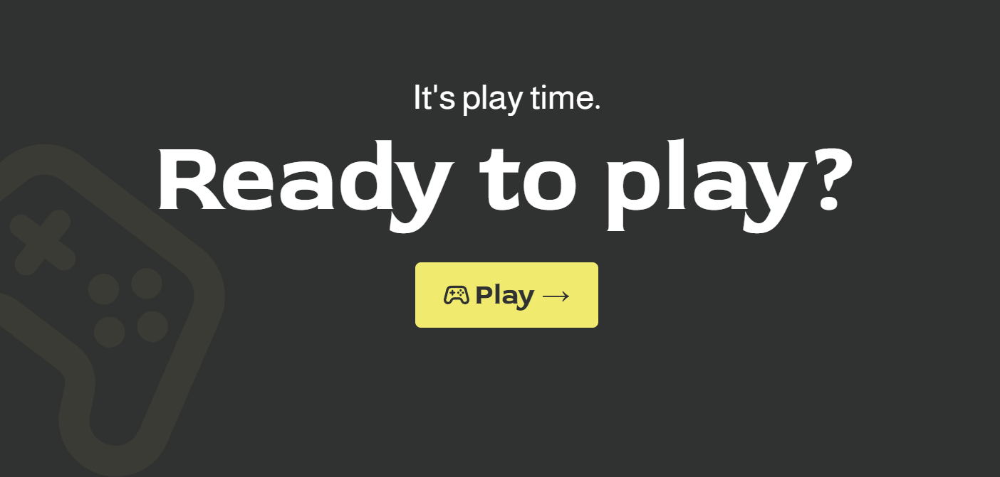
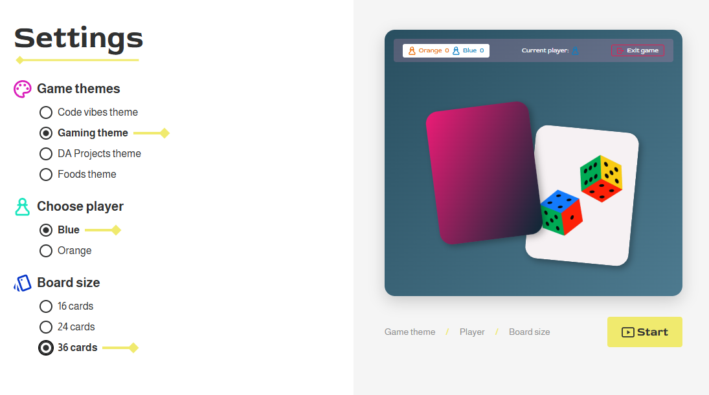
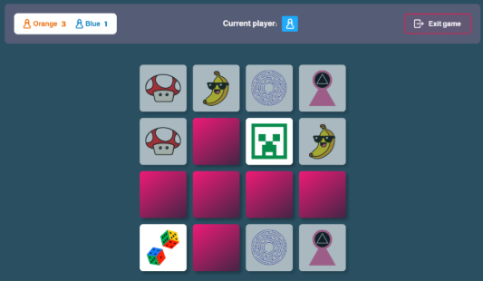
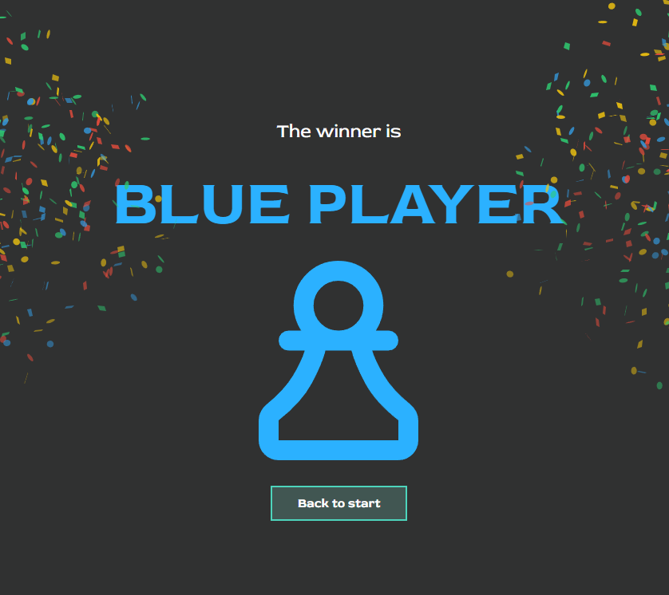

# Memory Game


A two-player memory card game with 4 themes, 3 board sizes, and fully responsive design — built with **Vite 6**, **TypeScript 5.x (strict)** and **SCSS** (7-1 pattern). No framework. No external UI libraries.



---

## Features

- **Two-player mode** — Blue vs. Orange, live score in the header
- **4 themes** — Code Vibes, Gaming, DA Projects, Foods (each with its own color scheme, motifs & typography)
- **3 board sizes** — 4×4 (16 cards), 4×6 (24 cards), 6×6 (36 cards)
- **Smooth flip animation** when revealing cards
- **Game Over + Winner screen** with confetti
- **Exit-confirm popup** with theme-specific styling
- **Responsive** — optimized for smartphones, tablets & desktop
- **Rotate lock** for very small landscape viewports (<500px height)
- **Accessibility** — semantic HTML, `aria-label`, `:focus-visible`, keyboard support

---

## How to Play

1. **Home** — Click Play
2. **Settings** — Choose theme, player color (Blue/Orange) and board size
3. **Game** — Flip two cards. Match? Score a point and go again. No match? Next player's turn
4. **Winner** — The player with the most pairs wins



---

## In Action





---

## Tech Stack

| Technology | Version | Purpose |
|---|---|---|
| Vite | 6.x | Dev server + build |
| TypeScript | 5.x (strict) | Type-safe logic |
| SCSS | — | Styling with 7-1 pattern |
| canvas-confetti | 1.x | Winner-screen confetti |

**No frameworks, no UI libraries.** Vanilla TypeScript + OOP.

---

## Setup

```bash
npm install
npm run dev       # Dev server (http://localhost:5173)
npm run build     # Production build
npm run preview   # Preview the build locally
npx tsc --noEmit  # TypeScript check
```

---

## Architecture

```
src/
├── main.ts                  # Entry point + router
├── types/types.ts           # Interfaces + type aliases
├── models/                  # OOP classes (Board, Card, Game, Player)
├── views/                   # Render functions per screen
├── services/                # Pure logic, no DOM
└── scss/
    ├── main.scss            # @use of all partials
    ├── abstracts/           # Variables, mixins
    ├── base/                # Reset, typography
    ├── components/          # Card, Popup, Score-Badge, Rotate-Overlay
    └── pages/               # Home, Settings, Game, GameOver, Winner
```

